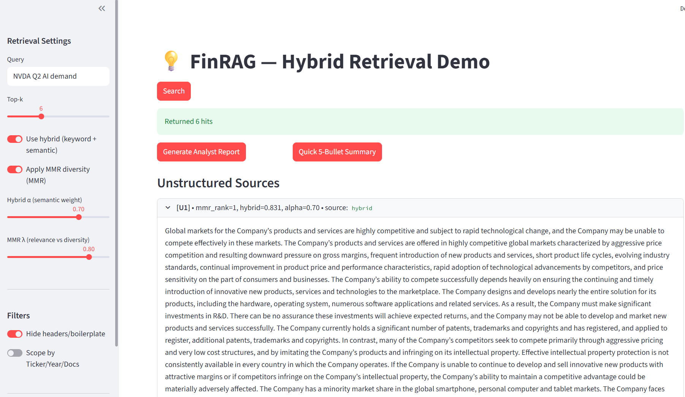
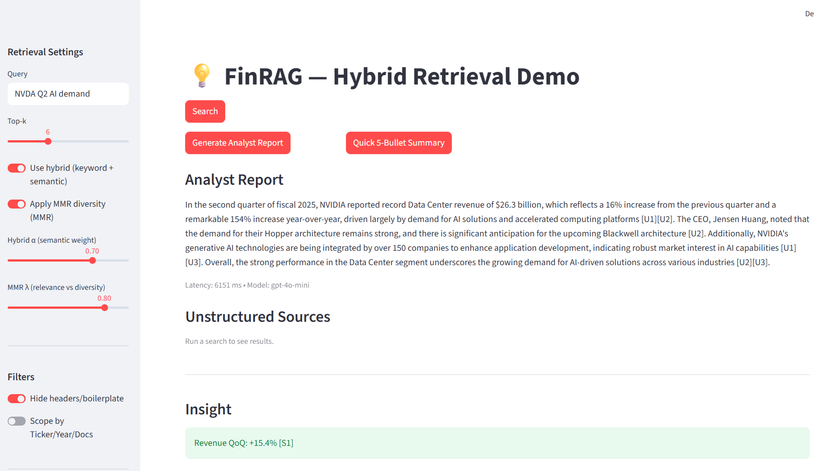
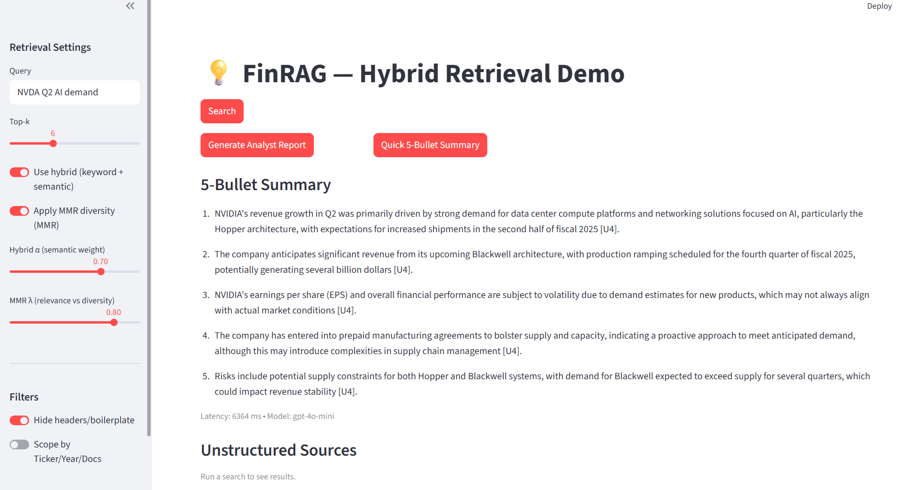

# FinRAG — AI Retrieval for Financial Docs

FinRAG is a small RAG prototype for financial analysis. It combines hybrid retrieval (BM25 + embeddings) with MMR diversity, header/boilerplate drop, cited LLM answers, and a one-click 5-bullet summary.

## Features
- Hybrid Retrieval + MMR: BM25 + semantic fusion (α) with Maximal Marginal Relevance (λ) for diverse, on-topic results.
- Header/boilerplate filter: removes noisy SEC covers, tables of contents, etc.
- Analyst Report: full cited answer using the OpenAI SDK.
- Quick 5-Bullet Summary: concise, cited recap using the OpenAI SDK.
- Insight banner (QoQ): simple revenue signal extraction from structured SQLite database.

---

## Quickstart

    # 1) Create & activate venv
    python -m venv .venv

    # Windows
    .venv\Scripts\activate

    # macOS/Linux
    source .venv/bin/activate

    # 2) Install dependencies
    pip install -r requirements.txt

    # 3) Set your OpenAI key
    # Windows (PowerShell)
    $env:OPENAI_API_KEY="sk-..."
    # macOS/Linux
    export OPENAI_API_KEY="sk-..."

    # 4) Run the app
    streamlit run app.py

---

## Data & Index Build (One-Time Setup)

FinRAG expects the following artifact files in `data/artifacts/`:

- chunks.json — raw text chunks extracted from documents
- corpus_chunks.parquet — same chunks stored in columnar format for fast loading
- finrag.index — FAISS vector index for semantic retrieval
- finrag_meta.parquet — metadata per chunk (ticker / year / quarter / doctype)
- finrag.db — SQLite database containing EPS/Revenue rows

### 1) Collect Raw Financial Documents

Place your source files here (example):

    data/raw/
        AAPL_10Q_2024Q2.pdf
        MSFT_Transcript_2024Q2.pdf
        NVDA_10K_2024.pdf
        financials.csv

### 2) Run the Ingestion Pipeline

    python build_corpus.py
    python ingest/export_chunks.py
    python db/seed.py

---

## Core Demo Flow

- Enter a query (e.g., “NVDA 2024 Q2 AI revenue”) and click Search.
- Click Generate Analyst Report for a detailed cited answer.
- Click Quick 5-Bullet Summary for an executive-style summary with citations.

---

## Tech Overview

- Streamlit UI
- HybridRetriever (BM25 + embeddings fusion, rank-normalize, stable union)
- MMR for diversity in result lists
- OpenAI SDK (gpt-4o-mini) for narrative question answering and summarization
- SQLite + CSV for structured EPS/Revenue financial tables
- metrics.py for simple Precision@k retrieval evaluation

---

## Limitations

- Dynamic scope dropdowns are basic.
- Document set is still small (~15 PDFs and ~64 structured rows).
- Precision@k scoring is preliminary.
- It is a prototype.

---

## Preview

| Hybrid Search Results | Analyst Report | 5-Bullet Summary |
|---|---|---|
|  |  |  |

---

## Screenshots

### Hybrid Search Results

*Shows top-k results with hybrid score, α, and optional MMR rank. Header/boilerplate text is filtered out.*

### Analyst Report (Cited)

*LLM answer grounded in retrieved context with explicit citations (e.g., [U#]/[S#]) and run latency.*

### 5-Bullet Summary

*Concise, cited recap for quick reading; reuses the same retrieval context.*

